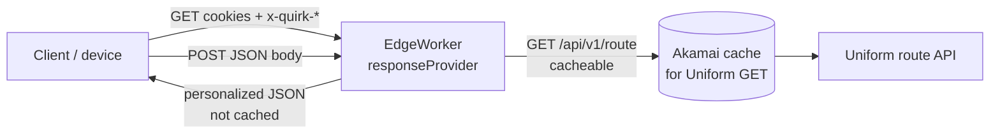
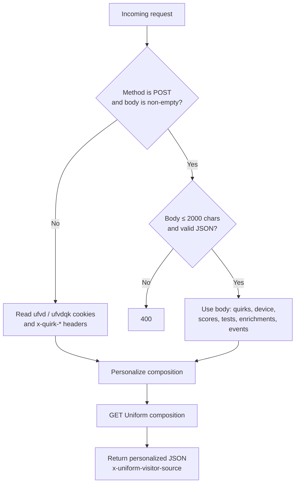
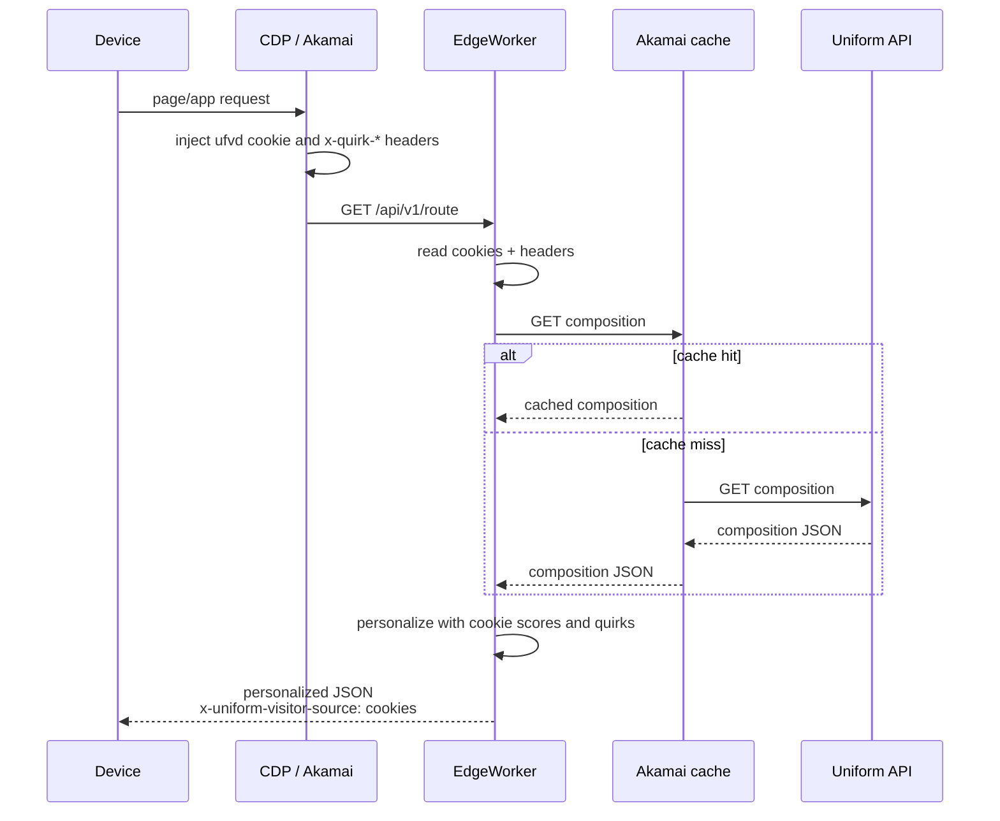
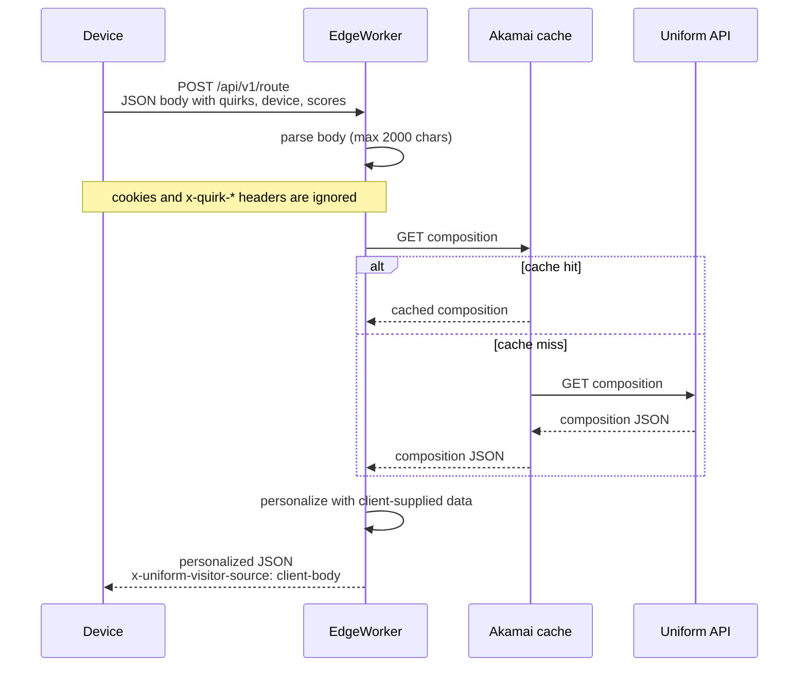

# Context as a Service
## Requirements

- Node.js (v18+)
- Akamai CLI
- Uniform CLI

## Environment Setup

1. Copy `.env.example` to `.env`
2. Fill in your environment-specific values:
   - `EW_ID`: Your Akamai EdgeWorker ID
   - `NETWORK`: Target network for activation (production/staging)
   - `VERSION`: EdgeWorker version to activate
   - `SANDBOX_HOSTNAME`: Your sandbox hostname
   - `SANDBOX_NAME`: Name for your sandbox environment
3. Install dependencies

```bash
npm install
``` 

## Usage

The scripts will use default values if environment variables are not set:
- EW_ID defaults to 80886
- NETWORK defaults to "production"
- VERSION defaults to "3.1.3"
- SANDBOX_HOSTNAME defaults to "akamai-artemn.unfrm.uno"
- SANDBOX_NAME defaults to "artem-caas-demo-v1"

To use custom values, either:
1. Set them in your `.env` file, or
2. Pass them inline.

## Visitor identity: cookies (default) or POST body

The EdgeWorker still **GET**s the Uniform route composition so that fetch can be cached. The personalized response returned to the client is not cached.



How visitor identity is chosen:



### Default: CDP / cookie injection

`GET /api/v1/route?...` with:

- `ufvd` / `ufvdqk` cookies (visitor scores, tests, quirks)
- `x-quirk-*` headers (device / CDP quirks)



### Side option: client-supplied JSON body

Because this worker controls the request the device makes, the client can **POST** the same visitor data instead of relying on cookie or header injection. `responseProvider` reads the body (quirks, scores, tests, device, enrichments, events), encodes scores/tests into the existing Uniform cookie format internally, and still fetches Uniform with GET.



Keep the JSON body at **2000 characters or fewer**. Oversized or invalid JSON returns `400`.

```bash
curl -X POST 'https://<ew-host>/api/v1/route?path=/' \
  -H 'Content-Type: application/json' \
  -d '{
    "quirks": { "role": "developer" },
    "device": { "os": "ios", "type": "phone" },
    "scores": { "isdevelopersignal": 10 },
    "tests": { "mytest": "var1" },
    "enrichments": [{ "cat": "audience", "key": "dev", "str": 10 }],
    "events": [{ "event": "app_open" }]
  }'
```

```ts
await fetch(`${ewHost}/api/v1/route?path=/`, {
  method: 'POST',
  headers: { 'Content-Type': 'application/json' },
  body: JSON.stringify({
    quirks: { role: 'developer' },
    device: { os: 'ios', type: 'phone' },
    scores: { isdevelopersignal: 10 },
    tests: { mytest: 'var1' },
  }),
});
```

An empty POST body falls back to cookies and `x-quirk-*` headers. A non-empty POST body is the source of truth and ignores injected cookies/headers. Successful responses include `x-uniform-visitor-source: client-body` or `cookies` so you can see which path ran.
